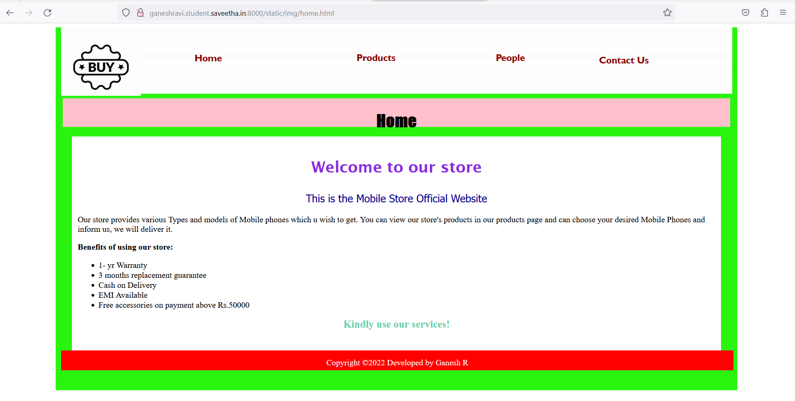
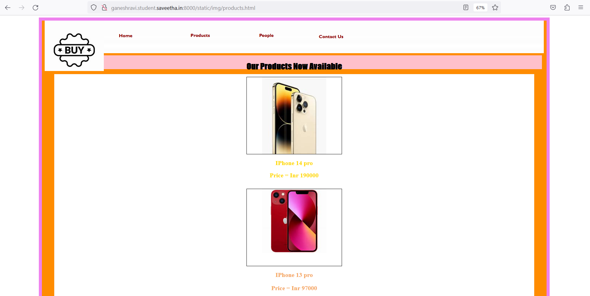
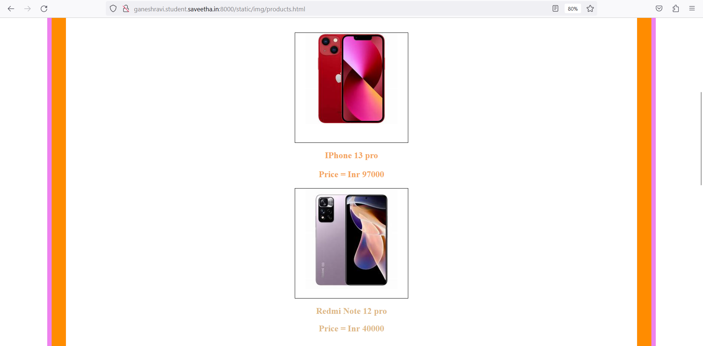
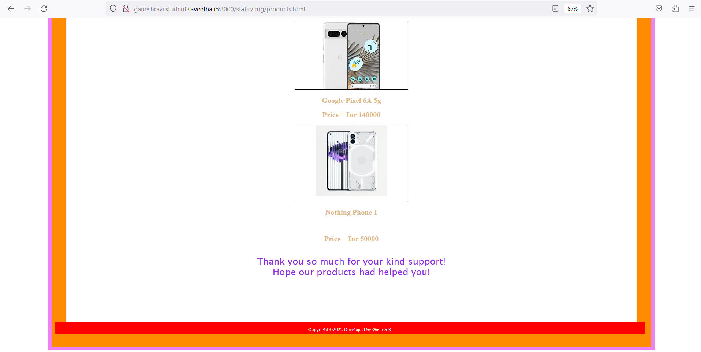
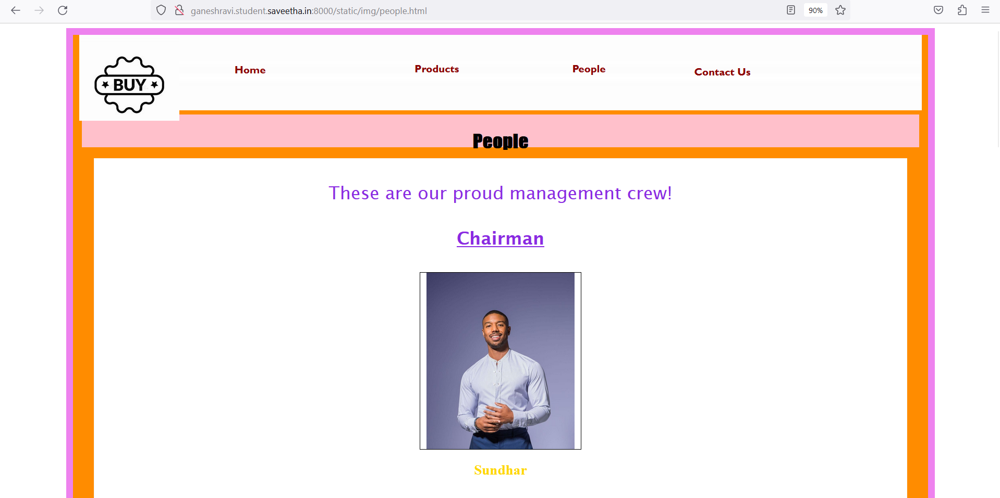
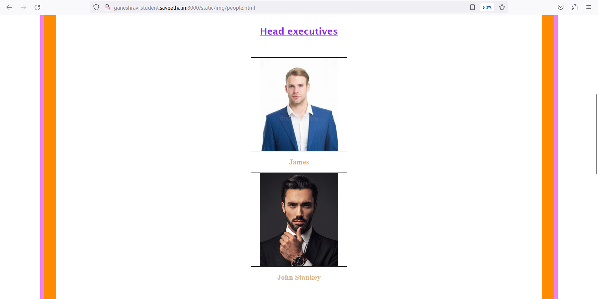
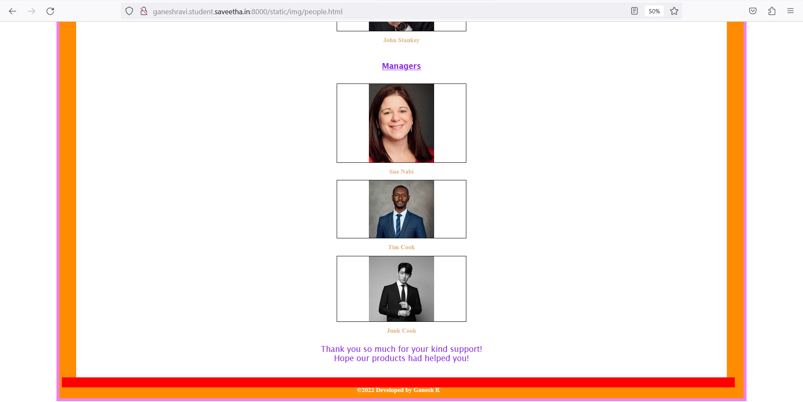
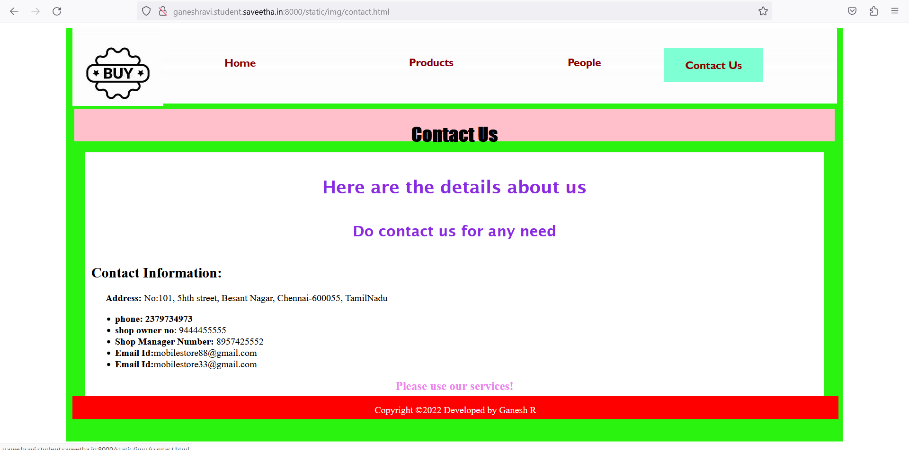
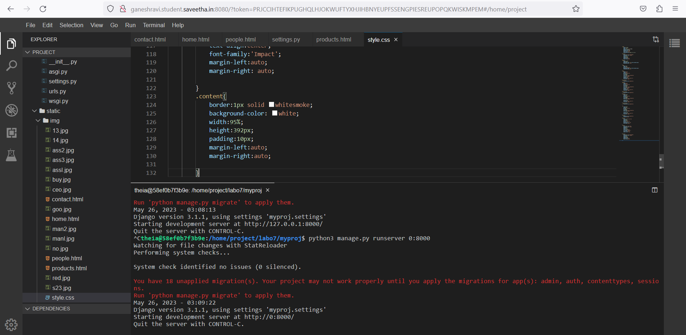
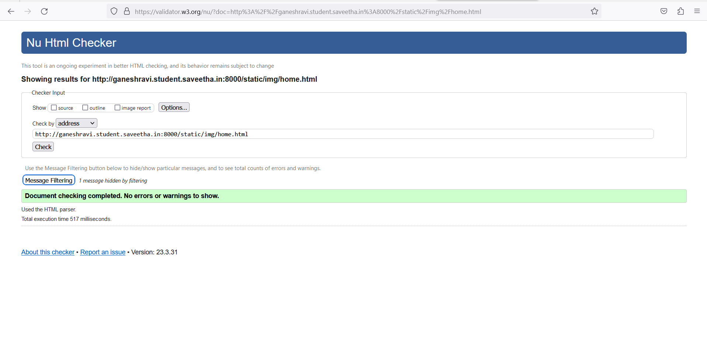

# Web Design for a Software Product Company

## AIM:

To design a static website for a software product company company.

## DESIGN STEPS:

### Step 1:

Requirement collection.

### Step 2:

Creating the layout using HTML and CSS.

### Step 3:

Updating the sample content.

### Step 4:

Choose the appropriate style and color scheme.

### Step 5:

Validate the layout in various browsers.

### Step 6:

Validate the HTML code.

### Step 6:

Publish the website in the given URL.

## PROGRAM :
```html
 home.html
<!DOCTYPE html>
<html lang="en">
    <head>
        <title>
            Home Page
        </title>
        <meta name="viewport" 
         content="width=device-width, initial-scale=1.0">
        <link rel="stylesheet" href="/static/style.css">
    <style>
    .text{
        color:blueviolet;
        font-family:'Lucida Sans';
        font-size: 30px;
        text-align:center;
    }
    
    </style>

    </head>
    <body>
        <div class="home">
            <div class="header">
                <header>
                    <div class=logo></div>
                    <div class=h>
                    <a href="home.html" title="Home" style="color: darkred; text-decoration: none;"><b>Home</b></a></div>
                    <div class="prod">
                        <a href="products.html" title="Products" style="color: darkred; text-decoration: none;"><b>Products</b></a>
                    </div>
                    <div class="people">
                        <a href="people.html" title="People" style="color:darkred; text-decoration: none;"><b>People</b></a>
                    </div>
                    <div class="contact">
                        <a href="contact.html" title="Contact Us" style="color:darkred; text-decoration: none;"><b>Contact Us</b></a>
                    </div>
                </header>
                <div class="title">
                    <h1>Home</h1>
                </div><br>
                <div class="content">
                    <div class="text">
                    <p><b>Welcome to our store</b></p>
                    <p style="color:darkblue; font-family:'Tahoma'; font-size:20px;"> This is the Mobile Store Official Website</p>
                    </div>
                    <p>Our store provides various Types and models of Mobile phones which u wish to get. You can view our store's products in our products page and can choose your desired Mobile Phones and inform us, we will deliver it.</p>
                    <b>Benefits of using our store:</b>
                    <ul>
                        <li>1- yr Warranty</li>
                        <li>3 months replacement guarantee</li>
                        <li>Cash on Delivery</li>
                        <li>EMI Available</li>
                        <li>Free accessories on payment above Rs.50000</li></ul>
                    <div style="text-align: center;color:mediumaquamarine;font-size:20px;"><b>Kindly use our services!</b></div>

                </div>
                <div class="footer">
                <footer style="color:white">
                Copyright &copy;2022 Developed by Ganesh R</footer></div>
            </div>
        </div>
    </body>
</html>
```
```html
People.html
<!DOCTYPE html>
<html lang="en">
    <head>
        <title>
            People
        </title>
        <meta name="viewport" content="width=device-width, initial-scale=1.0">
        <link rel="stylesheet" href="/static/img/style.css">
        <style>
        .home{
            height: 3000px;
            width: 85%;
            border: 12px solid violet;
            padding-left:10px;
            padding-right:10px;
            margin-left: auto;
            margin-right:auto;
            background-color:darkorange;
        }
        .text{
        color:blueviolet;
        font-family:'Lucida Sans';
        font-size: 30px;
        text-align:center;
        
        }
        .content{
            border:1px solid whitesmoke;
            background-color: white;
            width:95%;
            height:2690px;
            padding:10px;
            margin-left:auto;
            margin-right:auto;
        }
        .ceoph{
            background-image: url(/static/img/ceo.jpg);
            background-size: 250px;
            background-position-x: center;
            background-repeat: no-repeat;
            border:1px solid black;
            height:300px;
            width:20%;
            position:relative;
            left: 0px;
            margin-left:auto;
            margin-right: auto;
        }
        .ceo{
            color: gold;
            position:relative;
            text-align:center;
            
            
        }
        .manph1{
            background-image: url(/static/img/manl.jpg);
            background-size: 250px;
            background-position-x: center;
            background-repeat: no-repeat;
            border:1px solid black;
            height:300px;
            width:20%;
            position:relative;
            margin-left:auto;
            margin-right:auto;            
        }
        .man1{
            color: sandybrown;
            position:relative;
            text-align:center;
            
        }
        .manph2{
            background-image: url(/static/img/man2.jpg);
            background-size: 250px;
            background-position-x: center;
            background-repeat: no-repeat;
            border:1px solid black;
            height:300px;
            width:20%;
            position:relative;
            margin-left:auto;
            margin-right:auto;

            
        }
        .man2{
            color: burlywood;
            position:relative;
            text-align:center;
        }
        
        .amph1{
            background-image: url(/static/img/assl.jpg);
            background-size: 250px;
            background-position-x: center;
            background-repeat: no-repeat;
            border:1px solid black;
            height:300px;
            width:20%;
            position:relative;
            margin-left:auto;
            margin-right:auto;

            
        }
        .am1{
            color: burlywood;
            position:relative;
            text-align:center;
        }

        .amph2{
            background-image: url(/static/img/ass2.jpg);
            background-size: 250px;
            background-position-x: center;
            background-repeat: no-repeat;
            border:1px solid black;
            height:220px;
            width:20%;
            position:relative;
            margin-left:auto;
            margin-right:auto;

            
        }
        .am2{
            color: burlywood;
            position:relative;
            text-align:center;
        }
        .amph3{
            background-image: url(/static/img/ass3.jpg);
            background-size: 250px;
            background-position-x: center;
            background-repeat: no-repeat;
            border:1px solid black;
            height:250px;
            width:20%;
            position:relative;
            margin-left:auto;
            margin-right:auto;

            
        }
        .am3{
            color: burlywood;
            position:relative;
            text-align:center;
        }
        </style>
    </head>
    <body>
        <div class="home">
            <div class="header">
                <header>
                    <div class=logo></div>
                    <div class=h>
                    <a href="home.html" title="Home" style="color: darkred; text-decoration: none;"><b>Home</b></a></div>
                    <div class="prod">
                        <a href="products.html" title="Products" style="color: darkred; text-decoration: none;"><b>Products</b></a>
                    </div>
                    <div class="people">
                        <a href="people.html" title="People" style="color:darkred; text-decoration: none;"><b>People</b></a>
                    </div>
                    <div class="contact">
                        <a href="contact.html" title="Contact Us" style="color:darkred; text-decoration: none;"><b>Contact Us</b></a>
                    </div>
                </header>
                <div class="title">
                    <h1>People</h1>
                </div><br>
                <div class="content">
                    <div class="text">
                    <p>These are our proud management crew!</p>
                    <h4><u>Chairman</u></h4>
                    </div>
                    <div class="ceoph"></div>
                    <div class="ceo"><p align="center"><b><h2>Sundhar</h2></b></div>
                    <br>
                    <div class="text">
                        <p><b><u>Head executives</u></b></p><br>
                    </div>
                    <div class="manph1"></div>
                    <div class="man1"><p align="center"><b><h2>James</h2></b></p></div>
                    <div class="manph2"></div>
                    <div class="man2"><p><b><h2>John Stankey</h2></b></p></div>
                    <br>
                    <div class="text"><p><b><u>Managers</u></b></p></div><br>
                    <div class="amph1"></div>
                    <div class="am1"><p align="center"><b><h2>Sue Nabi</h2></b></p></div>
                    <div class="amph2"></div>
                    <div class="am2"><p align="center"><b><h2>Tim Cook</h2></b></p></div>
                    <div class="amph3"></div>
                    <div class="am3"><p align="center"><b><h2>Junk Cook</h2></b></p></div><br>
                    <div class="text">Thank you so much for your kind support!<br>Hope our products had helped you!</div>
                </div>
                <div class="footer">
                <footer style="color:white">
                <h2> &copy;2022 Developed by Ganesh R</footer></div></h2>
            </div>
        </div>
    </body>
</html>
```
```html
product.html
<!DOCTYPE html>
<html lang="en">
    <head>
        <title>
            People
        </title>
        <meta name="viewport" content="width=device-width, initial-scale=1.0">
        <link rel="stylesheet" href="/static/img/style.css">
        <style>
        .home{
            height: 3000px;
            width: 85%;
            border: 12px solid violet;
            padding-left:10px;
            padding-right:10px;
            margin-left: auto;
            margin-right:auto;
            background-color:darkorange;
        }
        .text{
        color:blueviolet;
        font-family:'Lucida Sans';
        font-size: 30px;
        text-align:center;
        
        }
        .content{
            border:1px solid whitesmoke;
            background-color: white;
            width:95%;
            height:2690px;
            padding:10px;
            margin-left:auto;
            margin-right:auto;
        }
        .ceoph{
            background-image: url(/static/img/14.jpg);
            background-size: 250px;
            background-position-x: center;
            background-repeat: no-repeat;
            border:1px solid black;
            height:300px;
            width:20%;
            position:relative;
            left: 0px;
            margin-left:auto;
            margin-right: auto;
        }
        .ceo{
            color: gold;
            position:relative;
            text-align:center;
            
            
        }
        .manph1{
            background-image: url(/static/img/13.jpg);
            background-size: 250px;
            background-position-x: center;
            background-repeat: no-repeat;
            border:1px solid black;
            height:300px;
            width:20%;
            position:relative;
            margin-left:auto;
            margin-right:auto;            
        }
        .man1{
            color: sandybrown;
            position:relative;
            text-align:center;
            
        }
        .manph2{
            background-image: url(/static/img/red.jpg);
            background-size: 250px;
            background-position-x: center;
            background-repeat: no-repeat;
            border:1px solid black;
            height:300px;
            width:20%;
            position:relative;
            margin-left:auto;
            margin-right:auto;

            
        }
        .man2{
            color: burlywood;
            position:relative;
            text-align:center;
        }
        
        .amph1{
            background-image: url(/static/img/s23.jpg);
            background-size: 250px;
            background-position-x: center;
            background-repeat: no-repeat;
            border:1px solid black;
            height:300px;
            width:20%;
            position:relative;
            margin-left:auto;
            margin-right:auto;

            
        }
        .am1{
            color: burlywood;
            position:relative;
            text-align:center;
        }

        .amph2{
            background-image: url(/static/img/goo.jpg);
            background-size: 250px;
            background-position-x: center;
            background-repeat: no-repeat;
            border:1px solid black;
            height:220px;
            width:20%;
            position:relative;
            margin-left:auto;
            margin-right:auto;

            
        }
        .am2{
            color: burlywood;
            position:relative;
            text-align:center;
        }
        .amph3{
            background-image: url(/static/img/no.jpg);
            background-size: 250px;
            background-position-x: center;
            background-repeat: no-repeat;
            border:1px solid black;
            height:250px;
            width:20%;
            position:relative;
            margin-left:auto;
            margin-right:auto;

            
        }
        .am3{
            color: burlywood;
            position:relative;
            text-align:center;
        }
        </style>
    </head>
    <body>
        <div class="home">
            <div class="header">
                <header>
                    <div class=logo></div>
                    <div class=h>
                    <a href="home.html" title="Home" style="color: darkred; text-decoration: none;"><b>Home</b></a></div>
                    <div class="prod">
                        <a href="products.html" title="Products" style="color: darkred; text-decoration: none;"><b>Products</b></a>
                    </div>
                    <div class="people">
                        <a href="people.html" title="People" style="color:darkred; text-decoration: none;"><b>People</b></a>
                    </div>
                    <div class="contact">
                        <a href="contact.html" title="Contact Us" style="color:darkred; text-decoration: none;"><b>Contact Us</b></a>
                    </div>
                </header>
                <div class="title">
                    <h1>Our Products Now Available</h1>
                </div><br>
                <div class="content">
                    <div class="text">
                    </div>
                    <div class="ceoph"></div>
                    <div class="ceo"><p align="center"><b><h2>IPhone 14 pro</h2></b></div>
                    <div class="ceo"><p align="center"><b><h2>Price = Inr 190000</h2></b></div>
                    <br>
                    <div class="text">
                    </div>
                    <div class="manph1"></div>
                    <div class="man1"><p align="center"><b><h2>IPhone 13 pro</b></p></div>
                    <div class="man1"><p align="center"><b><h2>Price = Inr 97000</b></p></div>
                    <div class="manph2"></div>
                    <div class="man2"><p><b><h2>Redmi Note 12 pro</h2></b></p></div>
                    <div class="man2"><p><b><h2>Price  = Inr 40000</h2></b></p></div>
                    <br>
                    <div class="amph1"></div>
                    <div class="am1"><p align="center"><b><h2>S23 ultra</h2></b></p></div>
                    <div class="am1"><p align="center"><b><h2>Price = Inr 120000 </h2></b></p></div>
                    <div class="amph2"></div>
                    <div class="am2"><p align="center"><b><h2>Google Pixel 6A 5g</h2></b></p></div>
                    <div class="am2"><p align="center"><b><h2>Price = Inr 140000</h2></b></p></div>
                    <div class="amph3"></div>
                    <div class="am3"><p align="center"><b><h2>Nothing Phone 1</h2></b></p></div><br>
                    <div class="am3"><p align="center"><b><h2>Price = Inr 50000</b></p></div><br>
                    <div class="text">Thank you so much for your kind support!<br>Hope our products had helped you!</div>
                </div>
                <div class="footer">
                <footer style="color:white">
                Copyright &copy;2022 Developed by Ganesh R</footer></div>
            </div>
        </div>
    </body>
</html>
```
```html
contact.html
<!DOCTYPE html>
<html lang="en">
    <head>
        <title>
            Contact Us
        </title>
        <meta name="viewport" 
         content="width=device-width, initial-scale=1.0">
        <link rel="stylesheet" href="/static/img/style.css">
    <style>
    .text{
        color:blueviolet;
        font-family:'Lucida Sans';
        font-size: 30px;
        text-align:center;
    }
    
    </style>

    </head>
    <body>
        <div class="home">
            <div class="header">
                <header>
                    <div class=logo></div>
                    <div class=h>
                    <a href="home.html" title="Home" style="color: darkred; text-decoration: none;"><b>Home</b></a></div>
                    <div class="prod">
                        <a href="products.html" title="Products" style="color: darkred; text-decoration: none;"><b>Products</b></a>
                    </div>
                    <div class="people">
                        <a href="people.html" title="People" style="color:darkred; text-decoration: none;"><b>People</b></a>
                    </div>
                    <div class="contact">
                        <a href="contact.html" title="Contact Us" style="color:darkred; text-decoration: none;"><b>Contact Us</b></a>
                    </div>
                </header>
                <div class="title">
                    <h1>Contact Us</h1>
                </div><br>
                <div class="content">
                    <div class="text">
                    <p><b>Here are the details about us
                    <h5>Do contact us for any need</h5></b></p>
                    
                    </div>
                    <b><h2>Contact Information:</h2></b>
                    <p><b>&emsp;&ensp;Address:</b>
                         No:101, 5hth street, Besant Nagar, Chennai-600055, TamilNadu
                    </p>
                    <ul>
                        <li><b>phone: 2379734973</b></li>
                        <li><b>shop owner no</b>: 9444455555</li>
                        <li><b>Shop Manager Number:</b> 8957425552</li>
                        <li><b>Email Id:</b>mobilestore88@gmail.com</li>
                        <li><b>Email Id:</b>mobilestore33@gmail.com</li>
                    </ul>
                    <div style="text-align: center;color:violet;font-size:20px;"><b>Please use our services!</b></div>

                </div>
                <div class="footer">
                <footer style="color:white">
                Copyright &copy;2022 Developed by Ganesh R</footer></div>
            </div>
        </div>
    </body>
```

## OUTPUT:

### Home Page:

## Product Page:



## People Page:



## Contact Page:

## Server Output:

## Web Validator:

## Result:
Thus a website is designed for the software product company and the HTML,CSS code are validated.
